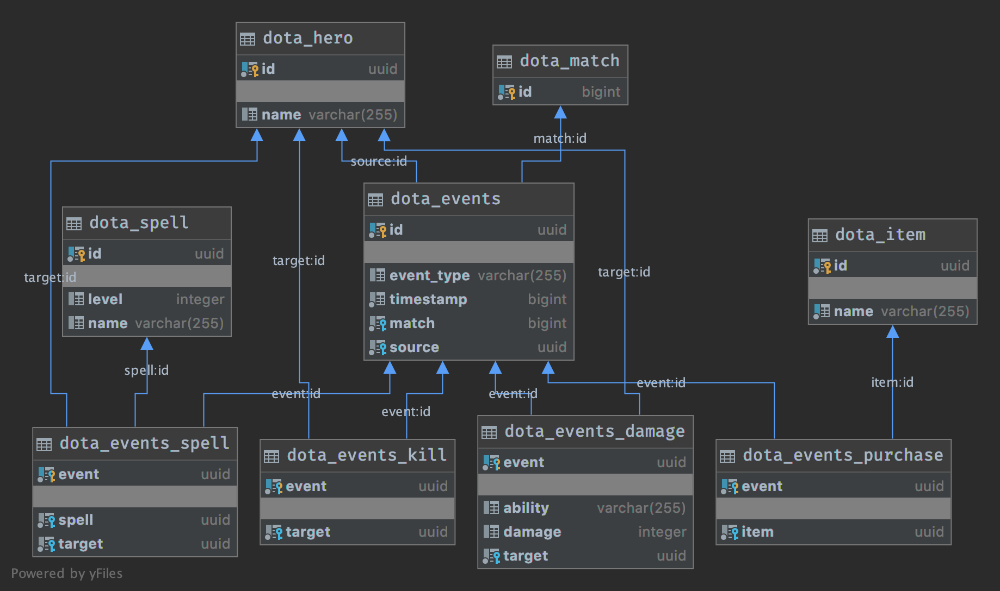

bayes-dota  
==========  
  
This is the [task](TASK.md).  
  
*Additional Info:*

 - This is the solution for the task (although incomplete, because I could fit writing tests within the time given). 
 - The DB design is given as below,
 - 
 - It took me 2 hrs 20 mins to complete the task without tests.
 - For the purpose of showcase, I wrote some test cases (1 controller integration test, 1 data integration test and 2 unit tests). But please note that these tests were written after the endtime was passed.
 - No new dependencies has been added
 - Things can certainly be improved in my code. For time constraint, I prioritised accuracy and design more. Things that can be improved,
	 - More tests
	 - Edge case handling
	 - Better performance (specially for ingest)
	 - Better DB design is possible if I know the other use cases for the data (for example, whether meta information needs to be stored as well)
	 - Simpler, more elegant code.
	 - Probably use a better tool for database migration (for example, Flyway)
